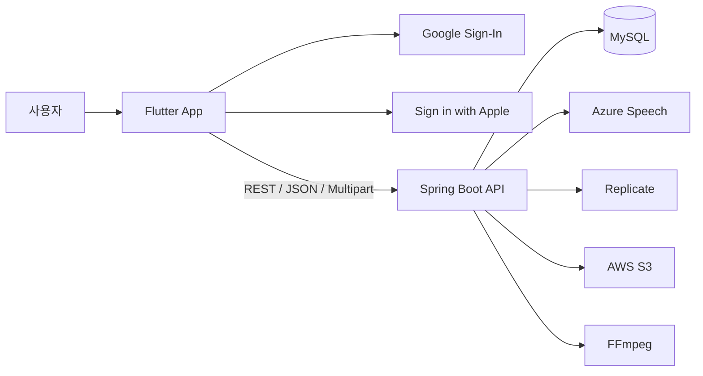

# LingKo

LingKo는 한국어 학습자가 자신의 발음을 녹음하고, 표준 발음·점수·글자별 피드백을 확인할 수 있도록 돕는 모바일 발음 학습 서비스입니다.

현재 저장소는 다음 두 애플리케이션을 함께 관리합니다.

- `app/`: Flutter 기반 iOS/Android 클라이언트
- `backend/`: Spring Boot 기반 REST API 및 외부 음성·미디어 연동

## 핵심 기능

- 추천 문장 조회 및 자유 문장 입력
- 한국어 표준 발음 변환과 글자별 발음 가이드 조회
- WAV 음성 녹음 및 발음 평가
- 정확도·유창성·완성도 점수와 취약 글자 표시
- Google OAuth·iOS Apple 로그인과 JWT 세션 저장
- 개인별 학습 설정과 연습 기록 조회
- 일일 무료 연습 횟수 조회
- 입·혀 가이드 이미지 및 비동기 영상 생성 작업

## 시스템 구성



자세한 설명은 [시스템 아키텍처](docs/architecture/system-architecture.md)를 참고합니다.

## 기술 스택

### App

- Flutter / Dart
- Material 3
- `record`
- `google_sign_in`
- `sign_in_with_apple`
- `flutter_secure_storage`

### Backend

- Java 21
- Spring Boot 3.4.1
- Spring MVC / Validation / Data JPA / WebFlux
- MySQL 8
- Flyway
- Azure Speech SDK
- AWS SDK for S3
- Gradle / JUnit 5 / JaCoCo

### Runtime

- Docker / Docker Compose
- FFmpeg

## 저장소 구조

```text
LingKo/
├── app/                         # Flutter 모바일 앱
├── backend/                     # Spring Boot API
├── docs/                        # 프로젝트 공통 문서
├── README.md                    # 프로젝트 진입점
├── CONTRIBUTING.md              # 브랜치·PR·문서 관리 규칙
└── CHANGELOG.md                 # 주요 변경 이력
```

## 빠른 실행

### 1. 백엔드 환경변수 준비

```bash
cd backend
cp .env.example .env
```

최소한 다음 값을 채웁니다.

```dotenv
DB_PASSWORD=local-password
JWT_SECRET_KEY=충분히-긴-랜덤-문자열
GOOGLE_CLIENT_ID=구글-웹-클라이언트-ID
AZURE_SECRET_KEY=애저-키
AZURE_REGION=애저-리전
```

외부 서비스 없이 실행할 수 있는 범위와 전체 변수 설명은 [로컬 개발 가이드](docs/development/local-development.md)를 확인합니다.

### 2. Docker Compose로 백엔드와 MySQL 실행

```bash
cd backend
docker compose up --build
```

기본 API 주소는 `http://localhost:8080`입니다.

### 3. Flutter 앱 실행

```bash
cd app
flutter pub get
flutter run
```

Flutter 앱의 기본 Backend는 `https://lingko-api.duckdns.org`입니다. 따라서 Xcode에서 직접 실행하거나 별도 `--dart-define` 없이 빌드해도 운영 HTTPS 서버에 연결됩니다.

로컬 Backend에 연결할 때만 플랫폼에서 접근 가능한 주소를 명시합니다.

```bash
flutter run \
  --dart-define=LINGKO_API_BASE_URL=http://192.168.0.10:8080 \
  --dart-define=GOOGLE_SERVER_CLIENT_ID=구글-웹-클라이언트-ID
```

## 검증 명령

### Backend

```bash
cd backend
./gradlew test
./gradlew integrationTest
```

Azure, Replicate, S3, FFmpeg를 실제로 호출하는 테스트는 별도로 실행합니다.

```bash
./gradlew externalIntegrationTest
```

### App

```bash
cd app
flutter analyze
flutter test
```

테스트 범위와 실행 조건은 [테스트 전략](docs/development/testing-and-troubleshooting.md)을 참고합니다.

## 주요 문서

- [문서 인덱스](docs/README.md)
- [제품·범위·용어](docs/overview/product-and-scope.md)
- [시스템 아키텍처](docs/architecture/system-architecture.md)
- [API 레퍼런스](docs/api/api-reference.md)
- [데이터 모델](docs/data/data-model.md)
- [로컬 개발 환경](docs/development/local-development.md)
- [운영 Runbook](docs/operations/operations-runbook.md)
- [보안·개인정보](docs/security/security-and-privacy.md)
- [기술 부채](docs/technical-debt.md)

## 현재 주의사항

- 최신 제품 기능은 현재 `main` 브랜치에 더 많이 반영되어 있으며, 저장소 기본 브랜치인 `develop`과 이력이 갈라져 있습니다.
- 문서 변경 PR은 `main`을 기준으로 작성합니다. 브랜치 정리 계획은 [ADR-0005](docs/architecture/adr/0005-branch-strategy.md)를 참고합니다.
- 평가 업로드 API는 아직 인증 사용자·쿼터 소비·평가 영속화 흐름을 완전히 연결하지 않았습니다.
- 가이드 생성 작업 상태는 현재 서버 메모리에만 저장됩니다.
- 운영 배포 파이프라인과 모니터링 시스템은 저장소에 완성된 형태로 존재하지 않습니다.

## 문서 변경 원칙

코드 계약, 환경변수, DB 스키마, 운영 절차가 변경되는 PR은 관련 문서를 같은 PR에서 함께 수정합니다. 문서와 코드가 다르면 코드가 실제 동작의 기준이지만, 불일치는 결함으로 취급합니다.
