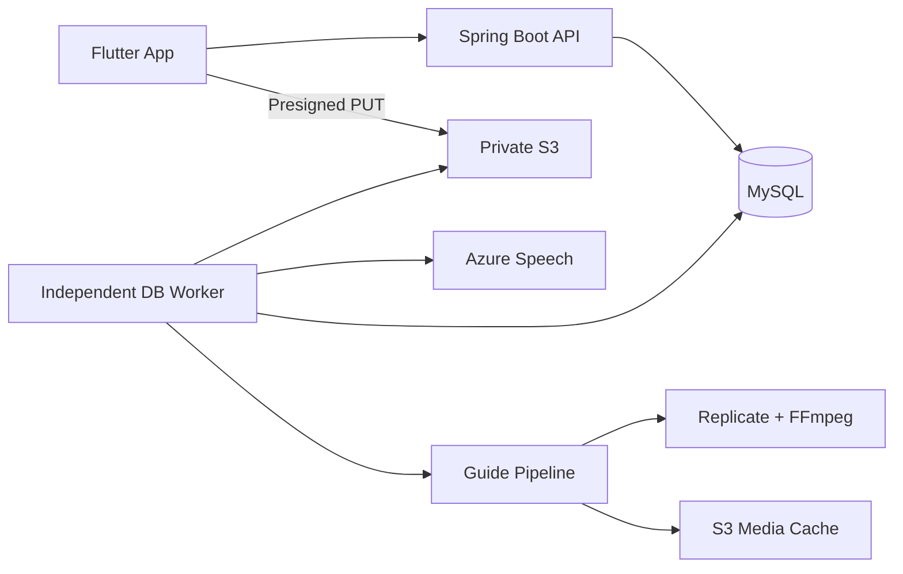

# LingKo

한국어 문장을 듣고, 말하고, 피드백을 확인하는 발음 학습 개인 프로젝트입니다. Flutter 모바일 앱과 Spring Boot 백엔드를 직접 설계·구현하며 인증, 비동기 작업, 외부 AI 연동, 데이터 정합성을 다룹니다.

## 주요 기능

- **문장 연습**: 6개 주제의 기본 추천 문장 48개와 자유 입력 문장. 표준 발음·로마자 가이드, TTS, 녹음을 제공합니다.
- **발음 평가**: 음성을 비공개 S3에 직접 업로드하고, 독립 Worker가 Azure Speech 평가를 처리합니다. 앱은 작업 상태를 조회해 결과를 표시합니다.
- **시각적 가이드**: 한글 음절을 초성·중성·종성으로 분해하고 입 모양 이미지·전이 영상을 연결합니다.
- **학습 기록**: 사용자별 평가 기록, 저장 문장, 재연습을 제공합니다. 단어 점수와 음절 가이드는 구분하며 없는 음절 점수를 추정해 표시하지 않습니다.
- **계정과 이용 정책**: 소셜 인증, 기기별 토큰 세션, 버전별 약관 동의, 시간 충전형 평가 기회와 서버 검증 광고 보상을 구현합니다.

## 시스템 구성

API는 인증·업로드 권한·작업 등록을 담당하고, 느린 음성 평가와 미디어 처리는 별도 Worker 프로세스가 담당합니다. 작업 상태와 결과는 DB에 저장합니다.

## 기술적 설계 포인트

| 문제 | 적용한 설계 |
|---|---|
| 네트워크 재시도로 중복 평가·차감 발생 | 사용자별 Idempotency 키와 작업 생성 트랜잭션 |
| 외부 평가가 API 응답을 오래 점유 | S3 직접 업로드와 영속 DB 작업, 독립 Worker |
| 동시 요청의 평가 기회 경쟁 | 조건부 UPDATE와 짧은 행 잠금, 예약·확정·복구 분리 |
| 만료된 토큰의 동시 갱신 | 서버 토큰 회전·재사용 감지와 앱의 단일 갱신 요청 |
| 반복되는 가이드 영상 생성 비용 | DB 미디어 조회와 결정적 S3 캐시 키 |
| 음성 평가 응답과 한글 단위 불일치 | 단어 정렬 검증, 실제 점수와 음절 가이드 분리 |

구체적인 선택과 제약은 [아키텍처](docs/architecture/system-architecture.md), [ADR](docs/architecture/adr/README.md), [문제 해결 사례](docs/engineering/case-studies.md)에 설명합니다. 문서는 저장소 구현을 설명하며 운영 배포 상태나 측정하지 않은 성능을 보장하지 않습니다.

## 기술 스택

- App: Flutter, Dart, Material 3
- Backend: Java 21, Spring Boot, Spring Security, JPA
- Data: MySQL, Flyway
- Integration: Azure Speech, AWS S3, Replicate, FFmpeg
- Verification: JUnit, Spring 통합 테스트, Flutter 테스트

## 코드와 문서

- [앱](app/README.md) · [백엔드](backend/README.md)
- [문서 목차](docs/README.md) · [제품 흐름](docs/overview/product-and-scope.md)
- [API 계약](docs/api/api-reference.md) · [데이터 모델](docs/data/data-model.md)
- [로컬 실행](docs/development/local-development.md) · [테스트 구성](docs/development/testing-and-troubleshooting.md)
- [보안 설계](docs/security/security-and-privacy.md) · [서비스 법무 문서](docs/legal/README.md)
