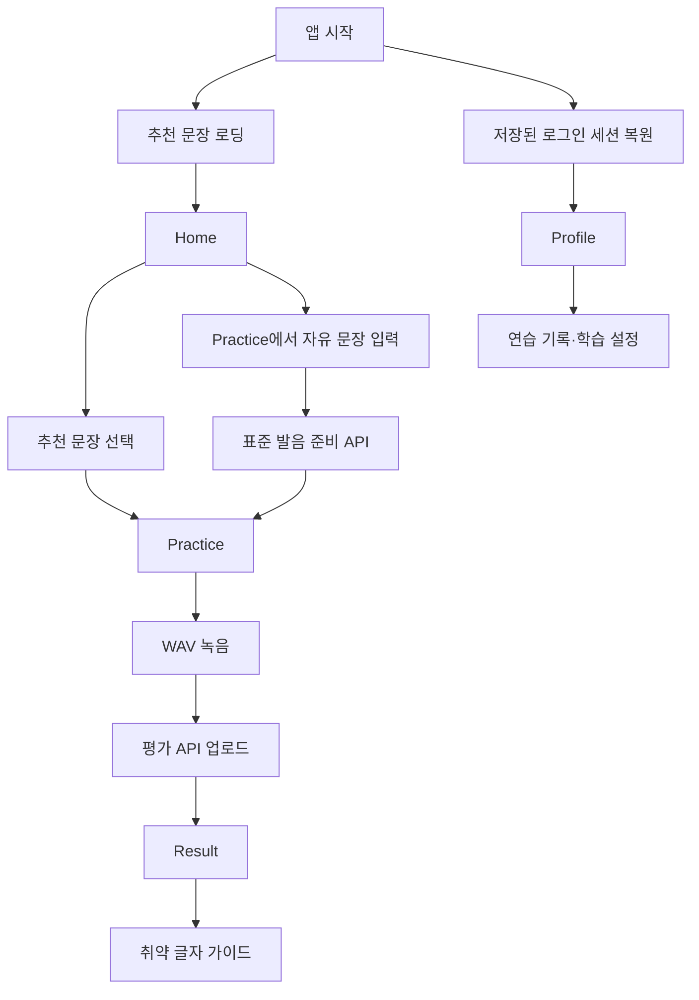

# LingKo Flutter App

LingKo의 iOS/Android 모바일 클라이언트입니다. 추천 문장 또는 사용자가 직접 입력한 문장을 연습하고, WAV 녹음을 백엔드에 업로드해 발음 평가 결과와 글자별 가이드를 확인합니다.

## 현재 기능

- 추천 문장 조회와 연습 화면 이동
- 자유 문장 입력과 표준 발음 준비
- 추천·자유 문장의 Unicode 문장부호·기호 제거와 서버 음운 규칙 기반 표준 발음 표시
- WAV 음성 녹음과 평가 업로드
- 정확도·유창성·완성도 점수 표시
- 취약 글자와 입·혀 가이드 표시
- Google 로그인
- Access/Refresh Token 보안 저장소 저장
- Access Token 만료 시 Refresh Token 회전과 요청 1회 재시도
- 로그인 세션 복원과 로그아웃
- 개인 연습 기록 조회
- 표시 언어·모국어·목표 레벨 설정
- 평가 실패·입력 검증·업로드 재시도 상태 처리

## 디렉터리 구조

```text
app/
├── android/                   # Android 네이티브 설정
├── ios/                       # iOS 네이티브 설정
├── lib/
│   ├── main.dart              # 앱 진입점
│   ├── app/                   # 앱 루트, 테마, 하단 탭 상태
│   ├── api/                   # Backend API client
│   ├── data/                  # 이전 mock 또는 정적 데이터
│   ├── models/                # API·화면 모델
│   ├── screens/               # Home, Practice, Result, Profile
│   ├── services/              # 인증 세션, Google 로그인, 녹음
│   └── widgets/               # 재사용 UI
├── test/                      # API·세션·Widget 테스트
├── pubspec.yaml
└── analysis_options.yaml
```

## 앱 흐름



## 주요 구성

### API

- `sentence_api.dart`: 추천 문장
- `pronunciation_api.dart`: 자유 문장 준비
- `evaluation_api.dart`: 평가 업로드와 연습 기록
- `auth_api.dart`: Google ID Token을 LingKo JWT로 교환
- `user_preferences_api.dart`: 학습 설정 조회·수정

### 인증

`DefaultAppAuthService`는 다음 순서로 로그인합니다.

1. `google_sign_in`으로 Google ID Token 획득
2. 백엔드 `POST /api/auth/oauth/login` 호출
3. LingKo Access/Refresh Token 수신
4. `flutter_secure_storage`에 세션 저장

보호 API가 `401`을 반환하면 Refresh Token을 한 번 회전하고 원래 요청을 한 번만 재시도합니다. 동시 `401`은 하나의 갱신 요청을 공유하며, 갱신 실패 또는 재시도 후 `401`이면 로컬 세션을 삭제하고 재로그인을 요구합니다.

### 녹음

`record` 패키지로 WAV를 생성합니다.

- Android: `RECORD_AUDIO` 권한, 최소 SDK 23
- iOS: `NSMicrophoneUsageDescription`, CocoaPods 필요
- 서버 요구 형식: 16-bit mono PCM WAV, 최대 10MiB

## 실행

```bash
flutter doctor
flutter pub get
flutter devices
flutter run
```

## API 주소

기본값:

- Android emulator: `http://10.0.2.2:8080`
- iOS simulator, desktop, tests: `http://localhost:8080`

실기기 또는 다른 백엔드 주소:

```bash
flutter run --dart-define=LINGKO_API_BASE_URL=http://192.168.0.10:8080
```

Google 로그인 포함:

```bash
GOOGLE_SERVER_CLIENT_ID=Google-Web-Client-ID \
DEVICE_ID=Flutter-Device-ID \
./scripts/run-local.sh ios

GOOGLE_SERVER_CLIENT_ID=Google-Web-Client-ID \
DEVICE_ID=emulator-5554 \
./scripts/run-local.sh android
```

`GOOGLE_SERVER_CLIENT_ID`는 백엔드의 `GOOGLE_CLIENT_ID`와 같은 Web application Client ID를 사용합니다.
스크립트는 iOS에서 `localhost`, Android emulator에서 `10.0.2.2`를 기본 Backend 주소로 사용합니다. 실기기는 `API_URL=http://개발-PC-IP:8080`을 함께 전달합니다.

Android Google 로그인은 Google Cloud의 Android OAuth Client에 `com.byeok.lingko` package name과 현재 Debug SHA-1이 등록되어 있어야 합니다.

```bash
cd android
./gradlew signingReport
```

## 검증

```bash
flutter analyze
flutter test
```

네이티브 설정을 변경한 경우:

```bash
flutter build apk --debug
```

릴리스 전에는 Android/iOS 실기기에서 마이크 권한, 실제 녹음, Google 로그인, 앱 재시작 후 세션 복원과 실제 Access Token 만료 후 자동 갱신을 확인합니다.

## 구조 원칙

- 화면은 API 구현보다 모델과 콜백에 의존하도록 구성합니다.
- 파일 크기보다 변경 이유를 기준으로 분리합니다.
- 현재 앱 루트 상태는 `StatefulWidget`에서 관리합니다.
- 인증·기록·설정이 확장됨에 따라 상태 관리 방식 도입을 검토합니다.
- API 계약이 바뀌면 앱 API 테스트와 백엔드 Controller 테스트를 함께 갱신합니다.

## 현재 제한

- 일일 쿼터 조회 UI와 평가 시 실제 차감 흐름은 완전히 연결되지 않았습니다.
- 문장 준비 단계는 정적 PNG 가이드를 사용하고, 평가 완료 결과는 점수 제공 여부와 관계없이 모든 음절의 다중 프레임 가이드를 MP4로 재생합니다. 단일 프레임과 생성 실패는 PNG로 fallback합니다.
- 최초 영상 cache miss는 외부 보간과 병합 시간이 필요할 수 있어 앱은 평가 작업을 최대 600초 동안 polling합니다.
- 일부 오래된 mock 데이터와 설명성 코드 정리가 필요합니다.

프로젝트 전체 구성과 운영 관점은 [루트 README](../README.md)와 [문서 인덱스](../docs/README.md)를 참고합니다.
