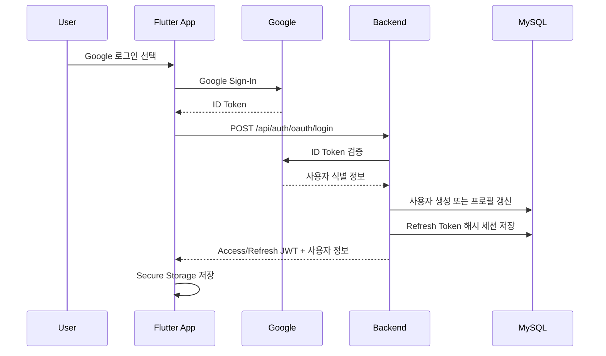
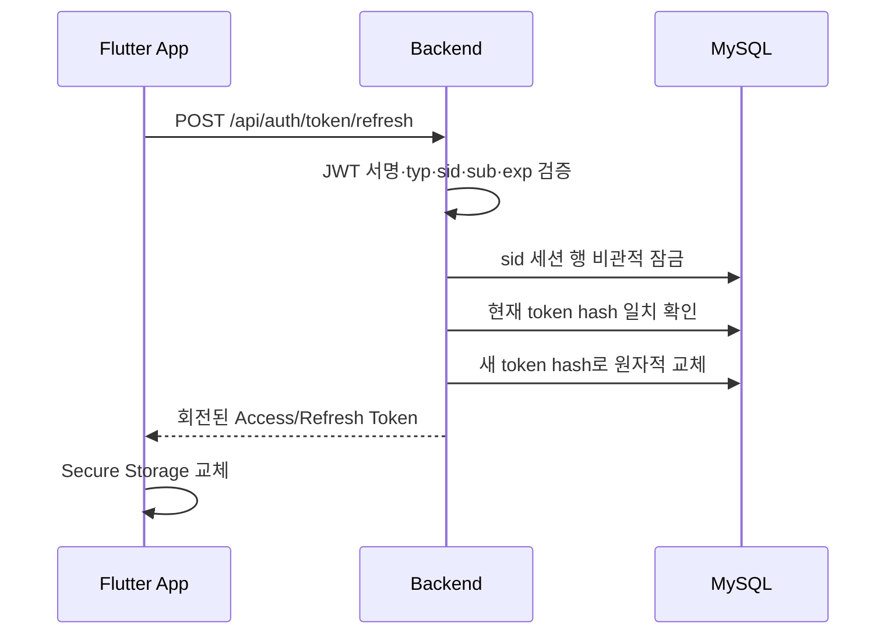

# 인증 흐름

## 로그인 순서



## 요청 계약

`POST /api/auth/oauth/login`

```json
{
  "provider": "GOOGLE",
  "idToken": "google-id-token"
}
```

응답에는 `tokenType`, `accessToken`, `refreshToken`, `expiresInSeconds`, `user`가 포함됩니다.

## 인증 API 사용

다음 API는 `Authorization: Bearer <access-token>`이 필요합니다.

- `GET /api/evaluations/me`
- `GET /api/quota/today`
- `GET /api/users/me/preferences`
- `PATCH /api/users/me/preferences`

토큰이 없거나 형식이 올바르지 않거나 검증에 실패하면 `401 AUTHENTICATION_FAILED`를 반환합니다.

## 모바일 세션

- 세션은 `flutter_secure_storage`에 저장합니다.
- 앱 시작 시 저장된 세션을 복원합니다.
- 보호 API가 `401`을 반환하면 Refresh Token으로 한 번 갱신하고 원 요청을 한 번만 재시도합니다.
- 동시에 여러 요청이 `401`을 받아도 앱은 하나의 refresh 요청만 실행합니다.
- refresh가 실패하거나 재시도도 `401`이면 로컬 세션을 삭제하고 로그인 화면으로 이동합니다.
- 로그아웃 시 현재 기기의 서버 세션을 폐기하고 로컬 세션을 삭제합니다.

## Refresh Token 회전과 폐기



- 서버는 Refresh Token 원문이 아니라 SHA-256 해시만 저장합니다.
- 각 로그인은 독립적인 기기 세션 `sid`를 생성합니다.
- Access Token도 같은 `sid`를 포함하며 보호 API는 DB 세션이 활성 상태인지 확인합니다.
- 회전 전 토큰이 다시 사용되면 재사용 공격으로 간주하고 해당 `sid` 세션 전체를 폐기합니다.
- 로그아웃 또는 재사용 탐지로 세션이 폐기되면 해당 세션의 Access Token도 남은 만료 시간과 관계없이 보호 API에서 거부됩니다.
- Refresh Token 절대 만료는 로그인 시점부터 기본 14일이며 회전으로 연장하지 않습니다.
- 현재 로그아웃은 현재 기기 세션만 폐기합니다. 전체 기기 로그아웃은 별도 후속 기능입니다.

## 운영 전 보완

- JWT 키 버전과 안전한 키 회전
- Google 검증 호출의 타임아웃·재시도
- 인증이 필요한 모든 사용자 기능에 공통 필터 적용
- 가이드 작업 관리자 권한
- 로그인·실패 이벤트 감사 로그

## 금지 사항

- ID Token, Access Token, Refresh Token, JWT 비밀키를 로그에 남기지 않습니다.
- `.env` 또는 실제 OAuth 비밀값을 커밋하지 않습니다.
- 모바일 앱에 서버 JWT 비밀키나 Google Client Secret을 포함하지 않습니다.
