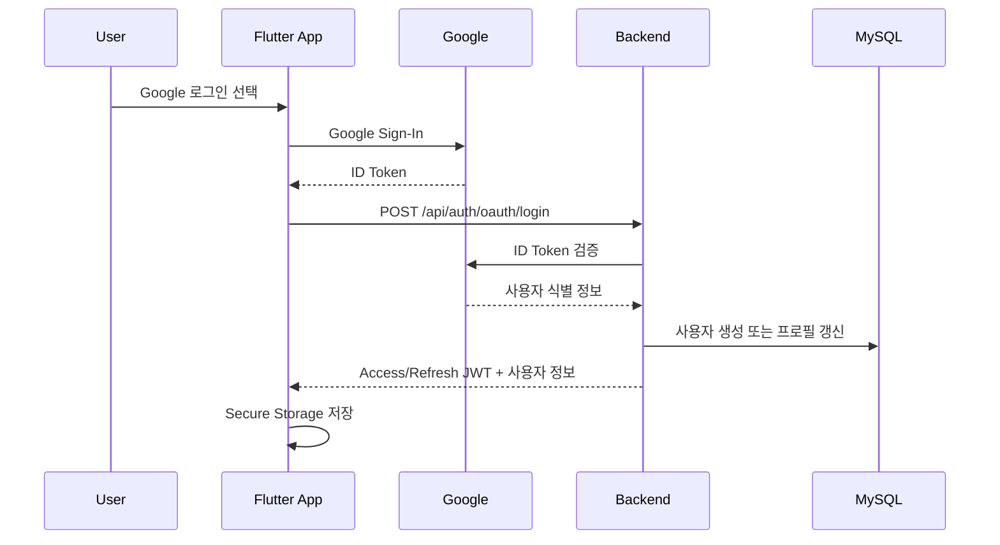

# 인증 흐름

## 로그인 순서



## 요청 계약

`POST /api/auth/oauth/login`

```json
{
  "provider": "GOOGLE",
  "idToken": "google-id-token"
}
```

응답에는 `tokenType`, `accessToken`, `refreshToken`, `expiresInSeconds`, `user`가 포함됩니다.

## 인증 API 사용

다음 API는 `Authorization: Bearer <access-token>`이 필요합니다.

- `GET /api/evaluations/me`
- `GET /api/quota/today`
- `GET /api/users/me/preferences`
- `PATCH /api/users/me/preferences`

토큰이 없거나 형식이 올바르지 않거나 검증에 실패하면 `401 AUTHENTICATION_FAILED`를 반환합니다.

## 모바일 세션

- 세션은 `flutter_secure_storage`에 저장합니다.
- 앱 시작 시 저장된 세션을 복원합니다.
- 로그아웃 시 로컬 세션을 삭제합니다.
- 현재 Refresh Token 자동 갱신과 서버 측 폐기 목록은 완성되지 않았습니다.

## 운영 전 보완

- Refresh Token 전용 API와 회전 정책
- 탈취 감지와 서버 측 토큰 폐기
- JWT 키 버전과 안전한 키 회전
- Google 검증 호출의 타임아웃·재시도
- 인증이 필요한 모든 사용자 기능에 공통 필터 적용
- 가이드 작업 관리자 권한
- 로그인·실패 이벤트 감사 로그

## 금지 사항

- ID Token, Access Token, Refresh Token, JWT 비밀키를 로그에 남기지 않습니다.
- `.env` 또는 실제 OAuth 비밀값을 커밋하지 않습니다.
- 모바일 앱에 서버 JWT 비밀키나 Google Client Secret을 포함하지 않습니다.
