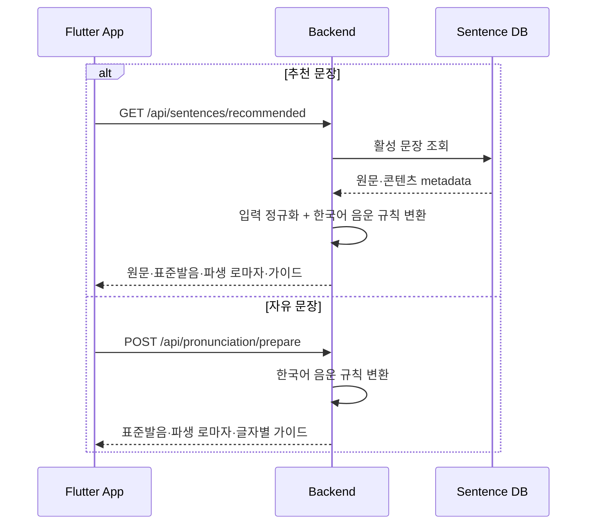
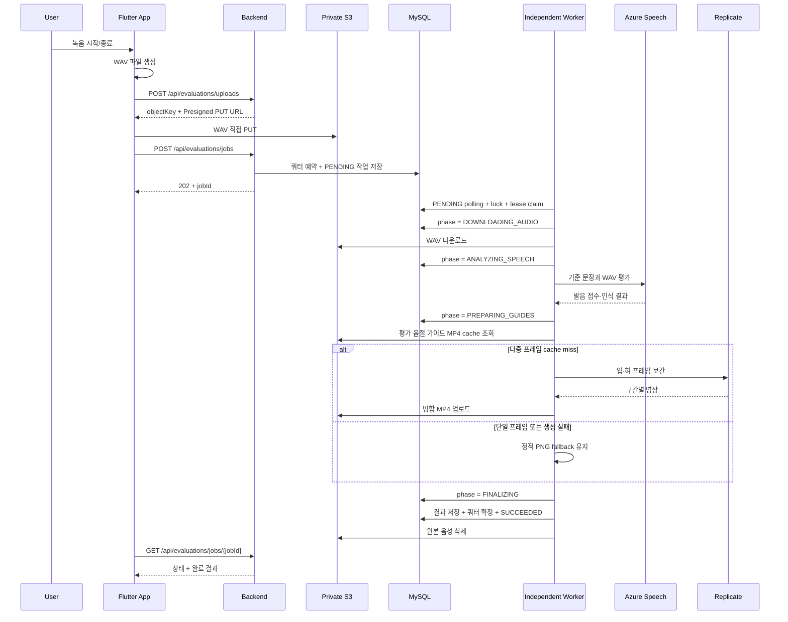

# 발음 평가 흐름

## 연습 준비

추천 문장 DB에는 원문과 콘텐츠 metadata만 저장합니다. 추천·자유 문장 모두 Unicode 문장부호·기호와 공백을 정규화한 원문을 `KoreanPhonemeUtil`의 현재 음운 규칙으로 변환하며, 추천 문장 조회·평가 작업 생성·재연습도 같은 경계를 사용합니다. `romanizedPronunciation`은 별도 저장하지 않고 확정된 표준 발음에서 음절 하이픈·단어 공백 형식으로 파생합니다. 평가 기록과 비동기 작업의 표준 발음은 당시 평가 재현을 위한 snapshot이지 추천 콘텐츠의 정답 원천이 아닙니다.



Review의 `Practice again`도 기록에 저장된 과거 표준 발음 snapshot을 그대로 사용하지 않습니다. 추천 문장은 단건 API를 다시 조회하고 자유 문장은 준비 API를 다시 호출해 현재 규칙으로 연습 대상을 갱신합니다.

## 녹음과 평가



## 업로드 계약

- 업로드 발급 요청은 파일명, `audio/wav`, 실제 byte 길이를 전달합니다.
- 앱은 응답받은 URL에 동일한 `Content-Type`과 길이로 직접 PUT합니다.
- 작업 생성 요청은 사용자 소유 `objectKey`와 `sentenceId` 또는 `text`를 전달합니다.
- 작업 생성은 8~100자의 `Idempotency-Key`가 필요합니다.
- 앱은 S3 PUT 동안 실제 byte 비율만 표시하고, 작업 생성 후에는 서버 phase를 단계 안내로 사용합니다. 각 단계 소요 시간이 다르므로 phase를 균등 백분율로 환산하지 않습니다.
- `sentenceId`와 `text` 중 하나는 반드시 필요
- 최대 크기: 10MiB
- 형식: 16-bit mono PCM WAV
- 허용 샘플링 레이트: 48kHz 이하

## 응답

평가 결과는 다음 정보를 제공합니다.

- `overallScore`
- `gradeLabel`
- `summary`
- `recognizedText`
- `characterScoreStatus`
- `wordScoreStatus`
- `scoreBreakdown.accuracy`
- `scoreBreakdown.fluency`
- `scoreBreakdown.completeness`
- `weakCharacters`
- `characters`
- `words[].position`, `words[].text`, `words[].score`, `words[].scoreStatus`
- `words[].syllables[]` (점수를 복제하지 않는 입·혀 가이드 단위)

## 현재 데이터 연결 상태

평가 작업 생성과 Worker는 다음 흐름을 수행합니다.

```text
활성 Bearer 세션 확인
  → 사용자 소유 S3 object metadata 확인
  → 추천·자유 문장 기준 정보 확정
  → Idempotency 확인과 현재 평가 기회 예약·충전 timer 시작
  → PENDING 작업 저장 후 202 응답
  → 독립 Worker가 DB polling으로 lease를 획득한 뒤 S3 다운로드·WAV 헤더 검증·외부 평가를 수행하며 실제 경계마다 phase 갱신
  → Azure detailed JSON의 단어 수·텍스트·위치를 기준 문장과 검증해 신뢰 가능한 단어 점수만 채택
  → 글자 점수 제공 여부와 관계없이 모든 평가 음절의 다중 프레임 입·혀 가이드를 cache 조회 또는 생성
  → 결과·단어 점수 snapshot·guide-only 음절 저장, 쿼터 확정과 SUCCEEDED를 단일 DB 트랜잭션으로 처리
  → 앱 Polling 응답
  → 완료 후 기본 7일 동안 Idempotency 응답 보존
  → 보존 기간이 지난 SUCCEEDED·FAILED 작업을 주기적으로 batch 삭제
```

평가 기회 예약은 자연 충전 횟수를 우선하고, 해당 횟수가 없으면 보상 횟수를 사용합니다. 최초 자연 충전 예약은 기존 timer가 없을 때만 1시간 timer를 시작합니다. 재시도 중에는 예약을 유지하고 최종 실패에서 원래 reservation token의 횟수를 복구하며 다시 5회가 되면 timer를 제거합니다. 원본 음성은 작업 처리 동안만 비공개 S3에 보관하고 성공·최종 실패 후 삭제하며 Lifecycle을 삭제 실패의 안전망으로 둡니다.

같은 사용자의 동시 작업 생성은 사용자 행의 짧은 비관적 lock으로 직렬화합니다. 기존 작업 확인과 쿼터 예약·작업 생성을 한 transaction에서 처리하므로 같은 Key 요청은 작업과 예약 각각 한 건으로 수렴합니다. 완료 작업 정리는 `completed_at`을 기준으로 하며 진행 중 작업을 삭제하지 않아 Worker 재처리와 예약 쿼터를 보호합니다.

Compose 운영에서는 API 내부 Worker를 끄고 web server가 없는 `evaluation-worker` 한 개가 MySQL을 polling합니다. DB가 작업 상태와 대기열의 원본이므로 별도 Queue가 없으며, 프로세스가 종료되면 lease가 만료된 `PROCESSING` 작업을 다시 claim합니다. 같은 Docker 호스트에서는 자원을 공유하지만 평가 작업의 프로세스 장애와 재시작 경계는 API와 분리됩니다.

가이드 영상은 문장 준비 단계가 아니라 평가 완료 결과를 조립할 때 모든 음절에 생성합니다. 글자 점수가 없더라도 Result에서 각 음절 가이드를 열 수 있으므로 점수가 아닌 프레임 전환 유무로 영상 여부를 결정합니다. 동일 음절·가이드 종류·프레임 조합은 결정적 S3 key로 cache하고 같은 프로세스의 동시 최초 요청도 직렬화합니다. 단일 프레임과 외부 생성 실패는 기존 PNG로 fallback하므로 평가 결과 자체를 잃지 않습니다. 최초 cache miss에는 Replicate polling과 FFmpeg 병합 시간이 포함될 수 있어 기본 Worker lease와 앱 polling 범위는 600초로 맞춥니다.

단어 점수는 공급자 token과 기준 문장의 공백 단위가 개수·텍스트·위치에서 모두 일치할 때만 사용합니다. 점수는 `evaluation_word`에 단어당 한 번 저장하고 `evaluation_syllable.word_position`으로 가이드 음절을 연결합니다. 한국어 음절 점수는 신뢰 단위로 사용하지 않으며 단어 점수를 음절 행이나 API 하위 항목에 복제하지 않습니다.

최종 실패의 쿼터 예약이 이미 사라진 비정상 상태에서는 예약 복구 결과를 오류로 다시 던지지 않고 작업을 `FAILED`로 commit합니다. 예약 불일치는 오류 로그와 운영 점검 대상으로 남기되, terminal transaction 롤백으로 같은 외부 실패가 영구 재실행되는 상황을 방지합니다.

## 실패 처리

| 상황 | 응답 |
|---|---|
| 업로드 metadata·소유권 오류 | 400 `INVALID_REQUEST` |
| 기준 문장 누락 | 400 `VALIDATION_FAILED` |
| 파일 크기 초과 | 413 `AUDIO_TOO_LARGE` |
| 추천 문장 없음 | 404 `SENTENCE_NOT_FOUND` |
| 작업 없음 또는 다른 사용자 소유 | 404 `EVALUATION_JOB_NOT_FOUND` |
| 같은 Idempotency Key의 다른 요청 | 409 `IDEMPOTENCY_CONFLICT` |
| 평가 기회 소진 | 429 `QUOTA_EXCEEDED` |
| Worker 최종 실패 | 작업 상태 `FAILED`, `errorCode=EVALUATION_FAILED` |

## 운영 전 개선

- Azure 호출 타임아웃과 재시도 정책
- 요청 ID를 통한 앱·백엔드·외부 호출 추적
- 평가 지연시간과 실패율 메트릭
- S3 Lifecycle과 삭제 실패 재처리
- 실제 기기의 Presigned PUT·Polling E2E
- 실제 MySQL에서 Worker 강제 종료와 lease 만료 복구 검증
- backlog와 DB lock을 측정한 뒤에만 Worker replica 또는 Queue 도입 검토
