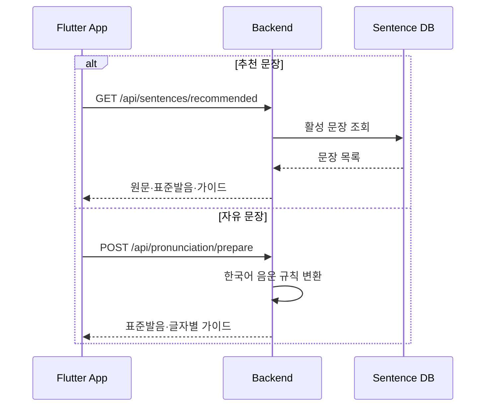
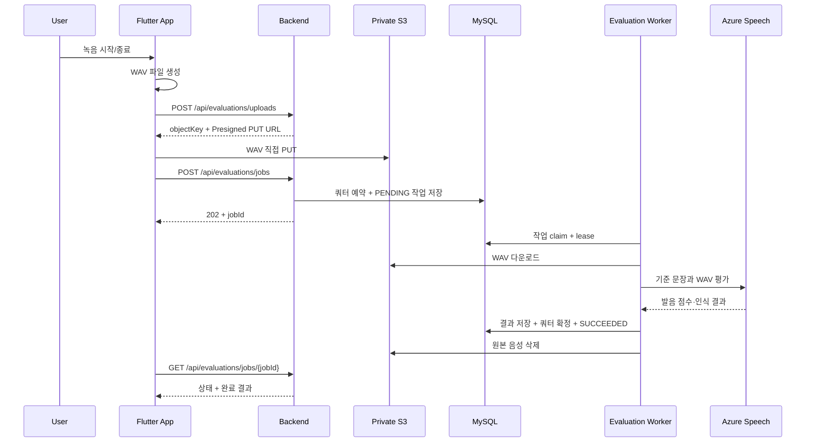

# 발음 평가 흐름

## 연습 준비

추천 문장은 서버의 문장 ID와 표준 발음을 사용합니다. 자유 문장은 `POST /api/pronunciation/prepare`를 호출해 표준 발음과 글자별 가이드를 생성합니다.



## 녹음과 평가



## 업로드 계약

- 업로드 발급 요청은 파일명, `audio/wav`, 실제 byte 길이를 전달합니다.
- 앱은 응답받은 URL에 동일한 `Content-Type`과 길이로 직접 PUT합니다.
- 작업 생성 요청은 사용자 소유 `objectKey`와 `sentenceId` 또는 `text`를 전달합니다.
- 작업 생성은 8~100자의 `Idempotency-Key`가 필요합니다.
- `sentenceId`와 `text` 중 하나는 반드시 필요
- 최대 크기: 10MiB
- 형식: 16-bit mono PCM WAV
- 허용 샘플링 레이트: 48kHz 이하

## 응답

평가 결과는 다음 정보를 제공합니다.

- `overallScore`
- `gradeLabel`
- `summary`
- `recognizedText`
- `characterScoreStatus`
- `scoreBreakdown.accuracy`
- `scoreBreakdown.fluency`
- `scoreBreakdown.completeness`
- `weakCharacters`
- `characters`

## 현재 데이터 연결 상태

평가 작업 생성과 Worker는 다음 흐름을 수행합니다.

```text
활성 Bearer 세션 확인
  → 사용자 소유 S3 object metadata 확인
  → 추천·자유 문장 기준 정보 확정
  → Idempotency 확인과 일일 쿼터 예약
  → PENDING 작업 저장 후 202 응답
  → Worker가 S3 다운로드·WAV 헤더 검증·외부 평가
  → 결과·음절 저장, 쿼터 확정과 SUCCEEDED를 단일 DB 트랜잭션으로 처리
  → 앱 Polling 응답
  → 완료 후 기본 7일 동안 Idempotency 응답 보존
  → 보존 기간이 지난 SUCCEEDED·FAILED 작업을 주기적으로 batch 삭제
```

쿼터 예약은 무료 횟수를 우선하고, 무료 횟수가 없으면 보상 횟수를 사용합니다. 재시도 중에는 예약을 유지하고 최종 실패에서 원래 날짜와 종류의 횟수를 복구합니다. 원본 음성은 작업 처리 동안만 비공개 S3에 보관하고 성공·최종 실패 후 삭제하며 Lifecycle을 삭제 실패의 안전망으로 둡니다.

같은 사용자의 동시 작업 생성은 사용자 행의 짧은 비관적 lock으로 직렬화합니다. 기존 작업 확인과 쿼터 예약·작업 생성을 한 transaction에서 처리하므로 같은 Key 요청은 작업과 예약 각각 한 건으로 수렴합니다. 완료 작업 정리는 `completed_at`을 기준으로 하며 진행 중 작업을 삭제하지 않아 Worker 재처리와 예약 쿼터를 보호합니다.

## 실패 처리

| 상황 | 응답 |
|---|---|
| 업로드 metadata·소유권 오류 | 400 `INVALID_REQUEST` |
| 기준 문장 누락 | 400 `VALIDATION_FAILED` |
| 파일 크기 초과 | 413 `AUDIO_TOO_LARGE` |
| 추천 문장 없음 | 404 `SENTENCE_NOT_FOUND` |
| 작업 없음 또는 다른 사용자 소유 | 404 `EVALUATION_JOB_NOT_FOUND` |
| 같은 Idempotency Key의 다른 요청 | 409 `IDEMPOTENCY_CONFLICT` |
| 일일 쿼터 소진 | 429 `QUOTA_EXCEEDED` |
| Worker 최종 실패 | 작업 상태 `FAILED`, `errorCode=EVALUATION_FAILED` |

## 운영 전 개선

- Azure 호출 타임아웃과 재시도 정책
- 요청 ID를 통한 앱·백엔드·외부 호출 추적
- 평가 지연시간과 실패율 메트릭
- S3 Lifecycle과 삭제 실패 재처리
- 실제 기기의 Presigned PUT·Polling E2E
- 다중 Worker 필요 시 SQS 전환
