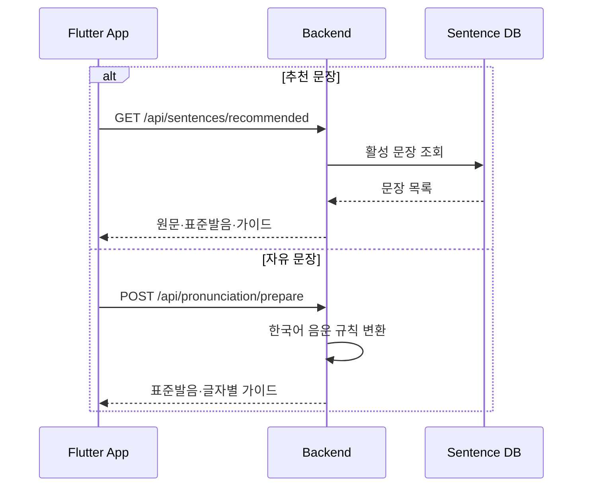
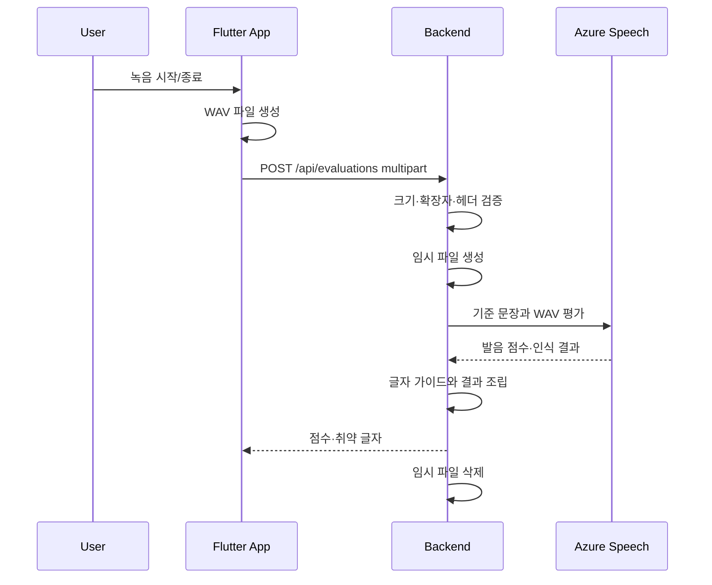

# 발음 평가 흐름

## 연습 준비

추천 문장은 서버의 문장 ID와 표준 발음을 사용합니다. 자유 문장은 `POST /api/pronunciation/prepare`를 호출해 표준 발음과 글자별 가이드를 생성합니다.



## 녹음과 평가



## 업로드 계약

- Content-Type: `multipart/form-data`
- `audio`: 필수 WAV 파일
- `sentenceId`: 추천 문장일 때 사용
- `text`: 자유 문장일 때 사용
- `sentenceId`와 `text` 중 하나는 반드시 필요
- 최대 크기: 10MiB
- 형식: 16-bit mono PCM WAV
- 허용 샘플링 레이트: 48kHz 이하

## 응답

평가 결과는 다음 정보를 제공합니다.

- `overallScore`
- `gradeLabel`
- `summary`
- `recognizedText`
- `characterScoreStatus`
- `scoreBreakdown.accuracy`
- `scoreBreakdown.fluency`
- `scoreBreakdown.completeness`
- `weakCharacters`
- `characters`

## 현재 데이터 연결 상태

평가 결과 영속화 서비스와 연습 기록 API가 존재하지만, 현재 `POST /api/evaluations`는 다음을 완전히 수행하지 않습니다.

- Bearer 토큰으로 사용자 식별
- 일일 쿼터 차감
- 평가 결과와 글자별 결과 저장
- 저장된 음성 URL 연결

운영 전에는 다음 트랜잭션 경계를 정의해야 합니다.

```text
인증 확인
  → 쿼터 확인·차감
  → 외부 평가
  → 결과·음절 저장
  → 응답
```

외부 평가 실패 시 쿼터를 차감할지, 예약 후 실패 시 복구할지를 명확히 결정해야 합니다.

## 실패 처리

| 상황 | 응답 |
|---|---|
| audio 누락 | 400 `VALIDATION_FAILED` |
| 기준 문장 누락 | 400 `VALIDATION_FAILED` |
| 파일 크기 초과 | 413 `AUDIO_TOO_LARGE` |
| WAV가 아님 | 415 `UNSUPPORTED_MEDIA_TYPE` |
| WAV 헤더 불일치 | 415 `INVALID_WAV` |
| 추천 문장 없음 | 404 `SENTENCE_NOT_FOUND` |
| 외부 평가 실패 | 502 `EVALUATION_FAILED` |

## 운영 전 개선

- Azure 호출 타임아웃과 재시도 정책
- 요청 ID를 통한 앱·백엔드·외부 호출 추적
- 대용량 multipart 제한의 서버·프록시 일치
- 평가 지연시간과 실패율 메트릭
- 사용자 취소와 중복 요청 처리
- 멱등성 키 또는 평가 요청 ID
