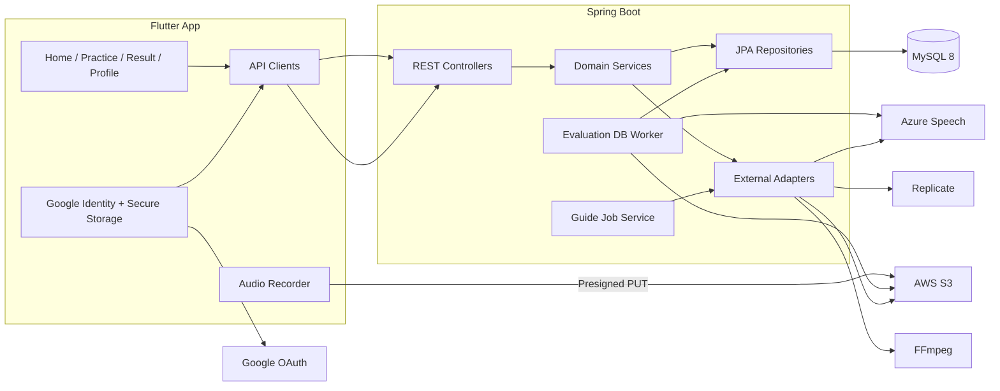

# 시스템 아키텍처

## 전체 구성

## 컴포넌트 책임

| 컴포넌트 | 책임 |
|---|---|
| Flutter UI | 사용자 흐름, 로딩·오류 상태, 녹음 제어, 결과 표시 |
| Flutter API 계층 | JSON 요청, Presigned S3 PUT, 작업 Polling, 응답 모델 변환 |
| 인증 서비스 | Google ID Token 획득, 백엔드 로그인, 세션 저장·삭제 |
| REST Controller | HTTP 계약·입력 검증·인증 토큰 해석 |
| Domain Service | 표준 발음, 평가, 기록, 설정, 쿼터, 작업 규칙 |
| JPA/Flyway | 영속 모델과 스키마 버전 관리 |
| Evaluation DB Worker | lease 기반 작업 claim, S3 다운로드, Azure 평가, 결과·쿼터 완료 |
| 외부 어댑터 | Azure Speech, Replicate, S3, FFmpeg 호출 |

## 배포 단위

현재 저장소 기준 배포 단위는 두 개입니다.

1. Flutter 앱: Android/iOS 빌드 산출물
2. Spring Boot 백엔드: Java 21 JAR 또는 Docker 이미지

백엔드 Docker 이미지는 빌드 단계와 실행 단계를 분리하며 실행 이미지에 FFmpeg를 설치합니다. 로컬 Docker Compose는 MySQL과 백엔드를 함께 실행합니다.

## 동기·비동기 경계

### 동기

- 로그인
- 추천 문장 조회
- 자유 문장 준비
- 기록·설정·쿼터 조회

### 비동기

- S3 직접 업로드 후 DB 기반 발음 평가 작업
- 가이드 영상 생성 작업

평가 작업은 MySQL에 영속화되어 서버 재시작 후 lease 만료 시 재처리됩니다. 가이드 작업은 여전히 `ConcurrentHashMap`과 프로세스 내 Executor를 사용하므로 서버 재시작 시 상태가 사라집니다.

## 신뢰 경계

- 모바일에서 전달된 Google ID Token은 백엔드가 검증한 후 자체 JWT를 발급합니다.
- Bearer JWT가 필요한 API는 기록, 사용자 설정, 쿼터 조회입니다.
- 평가 업로드·작업 API는 활성 Bearer 세션과 사용자별 S3 prefix를 검증합니다. 가이드 작업 API는 아직 인증 경계가 충분하지 않습니다.
- 외부 URL과 업로드 파일은 서버에서 형식과 크기를 검증해야 합니다.

## 주요 실패 지점

| 지점 | 영향 | 현재 대응 | 운영 전 보완 |
|---|---|---|---|
| MySQL 연결 실패 | 대부분 API 실패 | Docker healthcheck | 재시도, 알림, 백업 |
| Azure 실패 | 평가 지연·실패 | Worker 제한 재시도·최종 쿼터 복구 | 타임아웃·회로 차단기 |
| Replicate 실패 | 영상 생성 실패 | 작업 FAILED | 영속 큐·백오프 |
| S3 실패 | 미디어 저장 실패 | 예외 처리 | 재시도·수명주기 정책 |
| FFmpeg 실패 | 영상 합성 실패 | 작업 FAILED | 리소스 제한·관측성 |
| 서버 재시작 | 처리 중 작업 중단 | DB lease 만료 후 재claim | Worker 상태 메트릭 |
| JWT 키 변경 | 기존 토큰 무효 | 수동 | 키 회전 절차 |

## 확장 방향

운영 단계에서는 다음 순서를 권장합니다.

1. 운영 S3 Lifecycle과 Presigned PUT E2E 검증
2. Azure 타임아웃·Circuit Breaker·작업 메트릭 도입
3. 처리량 증가 시 DB claim 신호를 SQS로 전환
4. 가이드 작업을 DB 또는 메시지 큐로 이전
5. CI/CD와 환경별 설정 분리
6. 로그·메트릭·트레이싱과 장애 알림 추가
