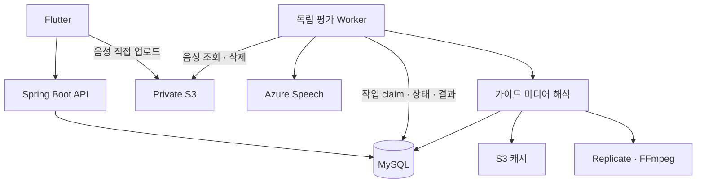

# 시스템 아키텍처

## 책임 분리

| 경계 | 책임 |
|---|---|
| Flutter | 세션 복원, 동의 gate, 녹음, 업로드, 상태 조회, 학습 UI |
| API | 인증·소유권·입력 검증, 티켓 발급, 작업 등록과 조회 |
| Domain | 쿼터 예약·확정·복구, 작업 상태 전이, 결과 영속화 |
| Worker | DB 작업 획득, 외부 평가·미디어 처리, 성공·실패 반영 |
| Infra | 외부 응답 파싱, S3 객체 처리, 미디어 생성·캐시 |
| MySQL / Flyway | 사용자 데이터, 영속 작업, 평가 결과, 스키마 버전 |

## 비동기 작업과 트랜잭션

API는 장시간 평가를 직접 기다리는 대신 DB에 작업을 등록합니다. 사용자별 Idempotency 키와 쿼터 예약을 작업 생성 트랜잭션에 묶어 재시도 시 중복 작업을 억제합니다.

Worker는 작업을 claim하고 상태·lease를 기록합니다. 외부 호출 전체에 DB 트랜잭션을 유지하지 않습니다. 완료 시 결과와 작업 상태, 쿼터를 반영합니다. DB의 상태 전이와 외부 서비스 실행은 서로 다른 경계이므로 외부 호출의 exactly-once를 보장한다고 해석해서는 안 됩니다.

## 가이드 캐시

초성·중성·종성 역할과 복합 모음의 구성 요소를 기존 이미지의 시간순 프레임으로 해석합니다. 특정 부위 이미지가 없는 자음 구간은 가장 가까운 실제 자세를 유지해 입·혀 트랙 길이를 맞추고, 연속된 동일 자세는 영상 전이에서 제거합니다. 저장된 음절·전이 유형의 MP4는 현재 매핑 버전과 일치할 때만 DB에서 재사용합니다. 최종 영상은 가이드 종류·프레임 순서·매핑 버전으로, 개별 전이 clip은 방향이 있는 두 프레임과 버전으로 결정적 S3 key를 구성합니다. 따라서 음절 문자가 달라도 같은 시각 결과와 전이는 공유하며, cache가 없을 때만 Replicate로 전이를 생성하고 FFmpeg로 조합합니다. 실패 시 기존 이미지 가이드가 대안이 됩니다.

사전 생성 planner는 문장 corpus의 크기에 의존하지 않고 현대 한글 11,172자를 운영 resolver로 전수 변환해 고유한 동적 시퀀스만 선택합니다. `phonology-v3` 기준 최종 영상 693개(MOUTH 61, TONGUE 632), 방향성 전이 clip 94개(MOUTH 26, TONGUE 68)이며, 숫자는 자동 test와 dry-run으로 고정합니다. 일상 문장 corpus는 이후 우선순위와 실제 사용성 검증에는 쓸 수 있지만 가이드 조합 누락을 결정하는 기준은 아닙니다.

사용자 평가의 영속 `evaluation_jobs`와 내부 가이드 생성 HTTP API의 작업 저장소는 다릅니다. 후자는 프로세스 메모리 기반이므로 재시작 후 작업 상태 조회를 지속하는 용도가 아닙니다. 기본 비활성화와 내부 토큰·요청 제한으로 접근을 구분합니다.

## 구성의 경계

기본 실행 구성은 API, MySQL, 독립 DB polling Worker 한 개입니다. 다중 Worker 처리량이나 장애 복구 성능을 측정한 결과로 간주하지 않습니다. Worker 확장은 작업 소유권, lease 만료와 중복 외부 호출을 함께 검토해야 합니다.

인증은 JWT 서명뿐 아니라 기기 세션의 활성 상태를 확인합니다. S3는 비공개 객체와 사용자별 업로드 권한을 사용합니다. 실제 외부 서비스 설정과 코드상 보호 장치는 구분합니다.

[평가 흐름](evaluation-flow.md) · [인증 흐름](authentication-flow.md) · [ADR](adr/README.md)
