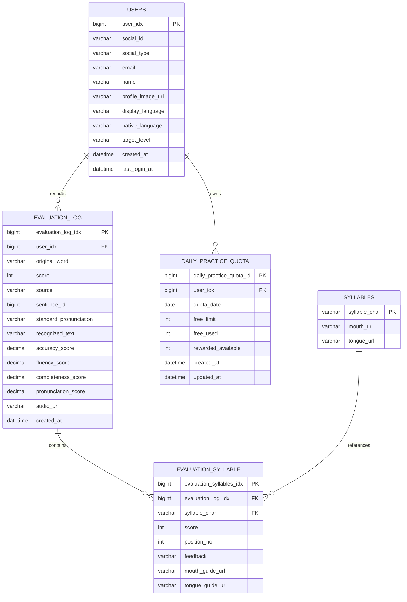

# 데이터 모델

## 핵심 관계

## 주요 제약

- `users`: `(social_id, social_type)` 유일
- `evaluation_log`: `(user_idx, created_at)` 조회 인덱스
- `evaluation_syllable`: `(evaluation_log_idx, position_no)` 유일
- `daily_practice_quota`: `(user_idx, quota_date)` 유일
- `daily_practice_quota.quota_date` 인덱스

## 데이터 소유권

| 데이터 | 소유자 | 삭제 기준 |
|---|---|---|
| 사용자 프로필 | 사용자 | 회원 탈퇴 정책 필요 |
| 학습 설정 | 사용자 | 사용자와 함께 삭제 |
| 평가 기록 | 사용자 | 사용자 삭제·보존 정책 필요 |
| 음성 URL | 사용자 평가 | 실제 S3 객체와 동기 삭제 필요 |
| 음절 가이드 | 서비스 공용 | 콘텐츠 관리 정책 적용 |
| 일일 쿼터 | 사용자·날짜 | 운영상 보존 기간 결정 필요 |

## 주의사항

- 엔티티와 실제 Flyway 스키마가 항상 일치하도록 테스트합니다.
- `sentence_id`는 추천 문장 참조지만 현재 엔티티 연관관계가 아닌 값으로 저장됩니다.
- 가이드 생성 작업은 DB 모델이 없으며 현재 메모리에만 저장됩니다.
- Refresh Token 저장 모델은 없습니다.
- 사용자 삭제 cascade 및 S3 객체 삭제 정책은 아직 명확하지 않습니다.
