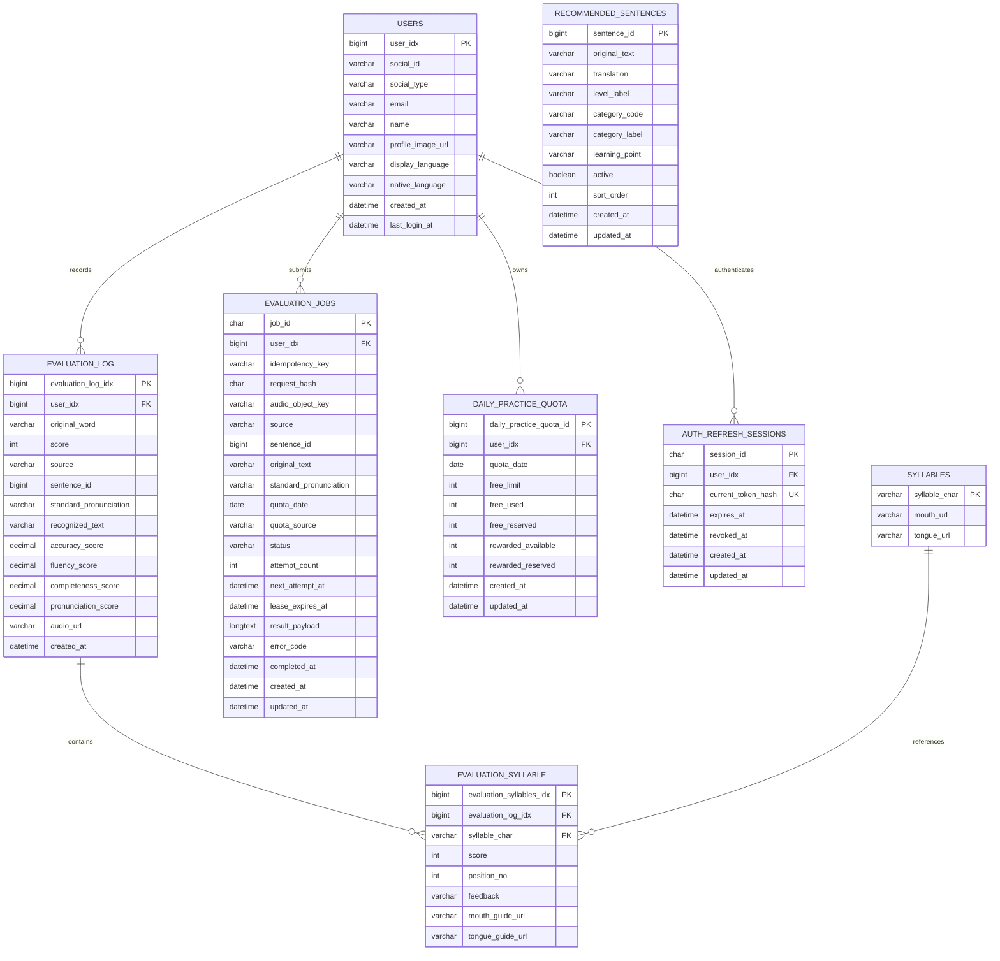

# 데이터 모델

## 핵심 관계

## 주요 제약

- `users`: `(social_id, social_type)` 유일
- `recommended_sentences`: 표준 발음을 저장하지 않고 원문을 현재 음운 규칙으로 변환
- `evaluation_log`: `(user_idx, created_at)` 조회 인덱스
- `evaluation_syllable`: `(evaluation_log_idx, position_no)` 유일
- `evaluation_jobs`: `(user_idx, idempotency_key)`, `audio_object_key` 유일
- `evaluation_jobs`: `(status, next_attempt_at, lease_expires_at, created_at)` Worker claim 인덱스
- `evaluation_jobs`: `(status, completed_at)` 완료 작업 정리 인덱스
- `evaluation_jobs.status`: `PENDING`, `PROCESSING`, `SUCCEEDED`, `FAILED`
- `daily_practice_quota`: `(user_idx, quota_date)` 유일
- `daily_practice_quota.quota_date` 인덱스
- `free_reserved`, `rewarded_reserved`는 외부 평가 중 확보한 횟수이며 성공 시 사용량으로 확정하고 실패 시 복구
- `auth_refresh_sessions.current_token_hash` 유일
- `auth_refresh_sessions`: `(user_idx, revoked_at)`, `expires_at` 조회 인덱스

## 데이터 소유권

| 데이터 | 소유자 | 삭제 기준 |
|---|---|---|
| 사용자 프로필 | 사용자 | 현재 Access·Refresh Token 재확인 후 회원 탈퇴 시 삭제 |
| 학습 설정 | 사용자 | 사용자와 함께 삭제 |
| 평가 기록 | 사용자 | 회원 탈퇴 DB transaction에서 음절 점수와 함께 삭제 |
| 평가 작업 | 사용자 | 회원 탈퇴 시 삭제, 그 외 성공·최종 실패 후 기본 7일 보존 |
| 평가 원본 음성 | 사용자 평가 작업 | 성공·최종 실패 후 삭제, 미제출·삭제 실패 객체는 1일 Lifecycle 만료 |
| 음절 가이드 | 서비스 공용 | 콘텐츠 관리 정책 적용 |
| 일일 쿼터 | 사용자·날짜 | 회원 탈퇴 시 삭제 |
| Refresh 세션 | 사용자·기기 | 로그아웃·만료·회원 탈퇴 시 폐기 또는 삭제 |

## 주의사항

- 엔티티와 실제 Flyway 스키마가 항상 일치하도록 테스트합니다.
- `sentence_id`는 추천 문장 참조지만 현재 엔티티 연관관계가 아닌 값으로 저장됩니다.
- `evaluation_log`와 `evaluation_jobs`의 `standard_pronunciation`은 평가 당시 기준을 재현하기 위한 snapshot이며 추천 콘텐츠의 정답 원천이 아닙니다.
- 가이드 생성 작업은 DB 모델이 없으며 현재 메모리에만 저장됩니다.
- Refresh Token 원문은 저장하지 않고 현재 토큰의 SHA-256 해시만 저장합니다.
- 평가 작업은 MySQL을 상태의 원본으로 사용하며 Worker 재시작 후에도 재시도할 수 있습니다.
- 평가 성공 시 결과는 `evaluation_log`와 `evaluation_jobs.result_payload`에 저장되고 원본 S3 객체는 삭제합니다.
- 완료된 평가 작업은 Idempotency 응답 재사용을 위해 기본 7일 보존한 뒤 batch 삭제하며 진행 중 작업은 자동 삭제하지 않습니다.
- 작업 생성 전 업로드됐지만 제출되지 않은 객체나 삭제 실패 객체는 `evaluation-audio/` 1일 Lifecycle로 정리합니다.
- 회원 탈퇴는 현재 object와 모든 S3 version·delete marker를 먼저 삭제하고, 성공한 경우에만 Refresh 세션 → 평가 작업 → 평가 음절·기록 → 쿼터 → 사용자 순서의 DB transaction을 실행합니다.
- 공용 `syllables` 기준 데이터는 특정 사용자가 소유하지 않으므로 회원 탈퇴 시 보존합니다.
