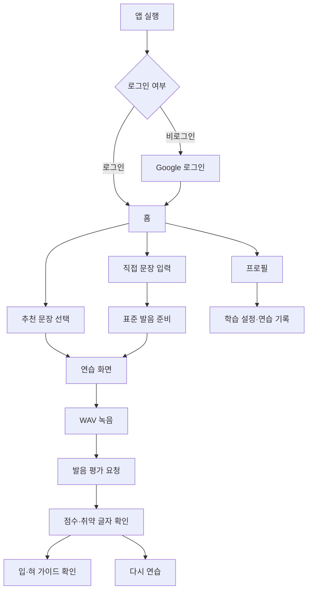

# 제품·범위·도메인

## 1. 제품 목적

LingKo는 한국어 학습자가 문장을 듣고 따라 말한 뒤, 발음 점수와 취약 글자별 가이드를 확인하도록 돕는 모바일 학습 서비스입니다.

핵심 가치는 다음과 같습니다.

- 짧은 문장 단위로 반복 연습
- 표준 발음 기준 제시
- 녹음 결과를 수치와 글자 단위로 피드백
- 반복 기록을 통해 자신의 약점을 확인

## 2. 주요 사용자 흐름

## 3. 현재 구현 범위

### 구현됨

- 추천 문장 목록 및 단건 조회
- 자유 문장 표준 발음 준비
- WAV 녹음 및 발음 평가
- 점수·인식 문장·취약 글자 표시
- 정적 입·혀 가이드 URL 표시
- Google OAuth 로그인
- Access/Refresh JWT 발급 및 모바일 보안 저장소 저장
- Refresh Token 회전·재사용 탐지·현재 기기 로그아웃과 모바일 자동 갱신
- 로그인 사용자의 연습 기록 조회
- 표시 언어·모국어 설정
- 1시간 단위 발음 평가 기회 조회·예약·충전
- 가이드 생성 작업 생성·상태 조회
- 앱 내 확인과 현재 세션 재확인을 거치는 회원 탈퇴·개인정보 삭제
- 평가 종료 즉시 원본 음성 삭제와 미제출 객체 1일 Lifecycle 정책

### 부분 구현

- 평가 결과 영속화 서비스와 조회 API는 있으나 현재 평가 업로드 API와 인증 사용자 연결이 완전하지 않음
- 광고 보상은 앱 callback UI만 있으며 광고 SDK·서버 보상 검증은 연결되지 않음
- 가이드 생성 작업은 비동기로 동작하지만 서버 메모리에만 상태 저장

### 계획 또는 운영 전 필수

- Apple/Kakao 로그인
- 운영 관리자 인증과 권한 관리
- 영속 작업 큐와 재시도 정책
- CI/CD, 모니터링, 알림, 백업 자동화

## 4. 핵심 도메인 용어

| 용어 | 의미 |
|---|---|
| 추천 문장 | 서버가 제공하는 연습용 문장 |
| 자유 문장 | 사용자가 직접 입력한 문장 |
| 표준 발음 | 한국어 음운 규칙을 적용한 평가 기준 문자열 |
| 평가 | 음성 파일과 기준 문장을 비교해 점수를 생성하는 작업 |
| 취약 글자 | 평가 결과에서 추가 연습이 필요한 글자 |
| 가이드 | 발음 시 입 또는 혀의 위치를 보여주는 이미지·영상 |
| 평가 기록 | 사용자별 과거 평가 결과와 글자별 피드백 |
| 평가 기회 | 최대 5회까지 보유하며 부족할 때 1시간마다 1회 자연 충전되는 발음 평가 에너지 |
| 보상 횟수 | 광고 등 검증된 보상으로 추가되는 평가 기회 |
| 가이드 생성 작업 | 여러 이미지 URL을 기반으로 가이드 영상을 만드는 비동기 작업 |

## 5. 핵심 비즈니스 규칙

- 추천 문장 조회 개수는 1~50 범위입니다.
- 연습 기록 페이지 크기는 1~50 범위입니다.
- 음성 평가는 WAV 파일만 허용합니다.
- WAV는 16-bit mono PCM이며 샘플링 레이트는 48kHz 이하여야 합니다.
- 음성 업로드 최대 크기는 10MiB입니다.
- 자연 충전 가능한 평가 기회는 최대 5회입니다.
- 5회 미만이면 서버 기준 1시간마다 1회 충전되며 날짜 변경으로 초기화하지 않습니다.
- Google 소셜 ID와 소셜 타입 조합은 사용자별로 유일합니다.

## 6. 성공 지표 후보

현재 코드에는 제품 지표 수집이 없으므로 다음은 향후 관측 후보입니다.

- 가입 후 첫 평가 완료율
- 일·주간 활성 학습자
- 사용자당 일평균 연습 횟수
- 평가 요청 성공률과 지연시간
- 반복 연습 전후 평균 점수 변화
- 가이드 조회 후 재연습 전환율
- 외부 평가·영상 생성 실패율
