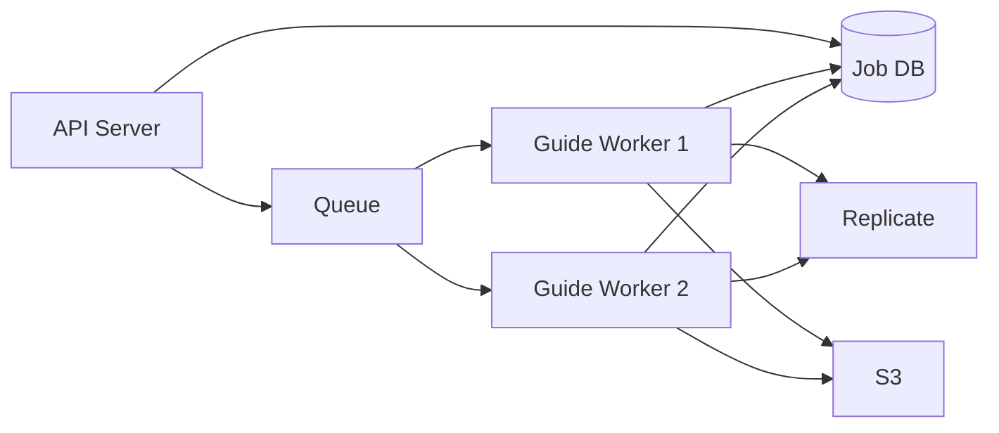
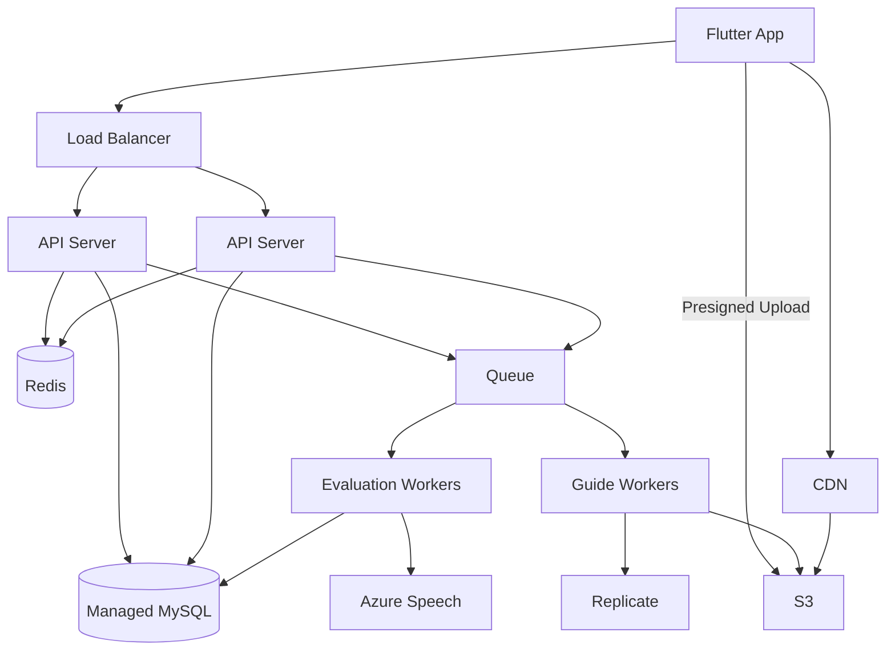

# LingKo 성능·확장성 계획

이 문서는 대규모 사용자를 고려할 때 LingKo가 어떤 순서로 병목을 측정하고 개선할지 정의합니다. 처음부터 복잡한 분산 시스템을 도입하지 않고, 실제 병목을 측정한 뒤 단계적으로 확장합니다.

## 1. 기본 방향

### 먼저 보장할 것

성능보다 먼저 다음 무결성을 보장합니다.

- 인증되지 않은 평가 금지
- 쿼터 초과 사용 금지
- 동일 요청의 중복 차감·중복 외부 호출·중복 저장 금지
- 작업과 평가 결과 유실 금지
- 사용자 간 데이터 격리

잘못된 결과를 빠르게 처리하는 것은 성능 개선이 아닙니다.

### 확장 순서

```text
정확성
→ 관측성
→ 쿼리 최적화
→ 캐시
→ 비동기 처리
→ Stateless API
→ 수평 확장
```

## 2. 현재 예상 병목

### 2.1 동기 음성 평가

2026-07-27부터 앱은 Presigned URL로 비공개 S3에 WAV를 직접 업로드하고 API는 DB 평가 작업 ID를 즉시 반환합니다. 단일 제한 Worker가 DB를 polling해 Azure 평가를 처리합니다.

위험:

- 현재 Worker는 같은 Spring 배포 단위에서 한 작업씩 처리
- Azure timeout·Circuit Breaker가 아직 없어 Worker 정체 가능
- S3 Lifecycle과 실제 기기 E2E는 운영 환경 설정 필요
- 다중 Worker 처리량과 Queue 기반 독립 확장은 미구현

단계적 대응:

1. 완료: 업로드 크기 제한, 쿼터 예약과 작업 생성 Idempotency
2. 완료: Presigned URL S3 직접 업로드
3. 완료: DB 영속 작업과 단일 제한 Worker, 앱 Polling
4. 후속: Azure timeout·Circuit Breaker와 작업 메트릭
5. 후속: 처리량 증가 시 SQS에 `jobId` 등록, Worker 독립 배포
6. 후속: 필요 시 Push 알림 추가

관련 Issue: [#39](https://github.com/byeok99/LingKo/issues/39), [#44](https://github.com/byeok99/LingKo/issues/44), [#47](https://github.com/byeok99/LingKo/issues/47)

### 2.2 평가 기록 N+1

평가 로그를 페이지로 조회한 뒤 각 로그의 음절 목록과 음절 기준 데이터를 Lazy Loading하면 페이지 크기에 따라 쿼리 수가 증가할 수 있습니다.

권장 해결 순서:

1. SQL 통계 또는 쿼리 카운터로 실제 N+1 재현
2. 평가 로그 ID를 먼저 페이지 조회
3. 해당 ID의 상세 데이터와 음절을 `IN` 조건으로 일괄 조회
4. 애플리케이션에서 평가 로그별 그룹핑
5. 필요하면 DTO Projection 또는 Batch Fetch 적용

주의:

- `OneToMany fetch join + Pageable`은 중복 행과 잘못된 페이징을 만들 수 있습니다.
- 성능 개선 전후의 쿼리 수와 실행 시간을 테스트로 남깁니다.

관련 Issue: [#45](https://github.com/byeok99/LingKo/issues/45)

### 2.3 Offset 페이지네이션과 COUNT

현재 모바일 기록 조회에 `PageRequest`를 사용하면 깊은 페이지에서 Offset 스캔 비용이 커지고, 전체 개수를 위한 Count 쿼리가 매번 실행될 수 있습니다.

권장 Cursor:

```http
GET /api/evaluations/me?cursorCreatedAt=2026-07-21T12:00:00&cursorId=1234&size=20
```

```sql
SELECT ...
FROM evaluation_log
WHERE user_idx = :userId
  AND (
    created_at < :cursorCreatedAt
    OR (created_at = :cursorCreatedAt AND evaluation_log_idx < :cursorId)
  )
ORDER BY created_at DESC, evaluation_log_idx DESC
LIMIT :sizePlusOne;
```

권장 인덱스:

```sql
CREATE INDEX idx_evaluation_user_created_id
ON evaluation_log (user_idx, created_at, evaluation_log_idx);
```

응답은 `totalPages`보다 `nextCursor`와 `hasNext` 중심으로 변경합니다.

관련 Issue: [#45](https://github.com/byeok99/LingKo/issues/45)

### 2.4 평가 저장 시 음절 반복 조회

결과 글자마다 `syllableRepository.findById()`를 호출하면 문장 길이에 비례해 DB 왕복이 늘어납니다.

개선 흐름:

```text
결과 글자 Set 생성
→ findAllById 1회
→ 없는 글자만 saveAll
→ Map으로 변환
→ EvaluationSyllable 생성
→ Batch Insert
```

추가 고려:

- `syllables`는 변경이 적은 기준 데이터이므로 로컬 캐시가 적합할 수 있습니다.
- 여러 요청이 같은 신규 음절을 동시에 저장할 때 Unique 제약 충돌을 안전하게 처리합니다.
- Hibernate batch insert를 적용하면 `IDENTITY` 키 전략이 batching을 제한하는지 확인합니다.

관련 Issue: [#46](https://github.com/byeok99/LingKo/issues/46)

### 2.5 가이드 생성 서버 내부 실행

현재 메모리 Map과 공용 ForkJoinPool 기반 작업은 다음 문제가 있습니다.

- 재시작 시 상태 유실
- 다중 인스턴스 간 상태 불일치
- 작업 등록 메서드의 동기화로 직렬 병목 가능
- 무제한 작업 제출 시 CPU·메모리·임시 디스크 고갈
- API 서버와 FFmpeg 작업의 자원 경쟁

개선 구조:



관련 Issue: [#41](https://github.com/byeok99/LingKo/issues/41), [#42](https://github.com/byeok99/LingKo/issues/42)

## 3. 목표 아키텍처

초기 확장 단계에서는 마이크로서비스보다 모듈형 모놀리스와 별도 Worker가 적합합니다.



### API 서버의 Stateless 조건

- 세션과 Refresh Token을 인스턴스 메모리에 저장하지 않음
- 영구 파일을 로컬 디스크에 저장하지 않음
- 작업 상태를 로컬 Map에 저장하지 않음
- 어느 인스턴스가 요청을 받아도 같은 결과
- 배포·종료 중 진행 작업은 Queue/DB를 통해 복구

## 4. 캐시 계획

Redis는 실제 읽기 병목을 확인한 후 도입합니다. 정확성이 중요한 데이터를 단순 캐시로 처리하지 않습니다.

| 데이터 | 권장 캐시 | 이유 | 주의사항 |
|---|---|---|---|
| 추천 문장 목록 | 로컬/Redis | 읽기 빈도 높고 변경 적음 | TTL Jitter, 빈 결과 캐시 |
| 문장 상세 | 로컬/Redis | ID 기반 반복 조회 | 수정 시 무효화 |
| 표준 발음 변환 | 로컬/Redis | 같은 문장 반복 계산 | 입력 정규화 후 키 생성 |
| 음절 가이드 URL | 로컬 캐시 우선 | 기준 데이터 성격 | 배포 중 갱신 정책 |
| 사용자 환경설정 | 짧은 Redis | 반복 조회 가능 | 수정 후 즉시 무효화 |
| 평가 기록 | 기본 미캐시 | 사용자별 변경 빈도 | 필요 시 첫 페이지만 짧게 |
| 최고 점수·통계 | Redis/집계 테이블 | 매 기록 조회 시 MAX 방지 | 저장 트랜잭션과 동기화 |
| 일일 쿼터 | DB 원자 UPDATE 또는 Redis 원자 연산 | 정확성 필수 | Cache-Aside 금지 |
| Refresh Token | Redis 또는 DB | 폐기와 TTL 필요 | 원문 대신 해시 저장 |
| 작업 상태 | DB + Redis 선택 | 빠른 Polling | DB가 진실의 원천 |

### 캐시 스탬피드 대응

- TTL에 랜덤 Jitter 추가
- 동일 키 동시 로딩 병합
- 분산 락은 필요한 키에만 적용
- stale-while-revalidate 검토
- 캐시 미스와 DB 부하 메트릭 수집

## 5. 동시성과 무결성

### 쿼터

권장 방식은 조건부 원자 UPDATE입니다.

```sql
UPDATE daily_practice_quota
SET free_reserved = free_reserved + 1
WHERE user_idx = :userId
  AND quota_date = :today
  AND free_used + free_reserved < free_limit;
```

영향받은 행이 1이면 성공, 0이면 소진 또는 행 부재입니다. 보상 예약과 예약 확정·복구도 각각 업무 조건을 포함한 원자 UPDATE로 처리합니다. 마지막 횟수 경쟁은 재시도하지 않고 HTTP 429로 반환합니다.

일일 행이 없는 최초 생성은 항상 존재하는 사용자 부모 행에 짧은 비관적 lock을 획득한 뒤 쿼터를 locking read로 재확인해 사용자·날짜별 행 하나만 생성합니다. 외부 평가 호출 전에 예약 transaction을 끝내므로 외부 응답 대기 중에는 DB lock을 유지하지 않습니다. 상세 결정은 [ADR-0006](../architecture/adr/0006-atomic-practice-quota-transitions.md)을 따릅니다.

### Idempotency

권장 키 범위:

```text
(user_id, idempotency_key)
```

저장할 값:

- 요청 payload hash
- 상태: PENDING / PROCESSING / SUCCEEDED / FAILED
- 평가 작업 ID 또는 결과 ID
- 생성·완료 시각
- 재시도 가능한 실패 여부

동일 키에 다른 payload가 들어오면 409로 거부합니다. 현재 구현은 동일 사용자의 작업 생성 transaction을 사용자 행 lock으로 직렬화해 동시 요청을 작업 1건과 쿼터 예약 1건으로 수렴시킵니다. 성공·최종 실패 작업은 완료 후 기본 7일 보존하고 `(status, completed_at)` 인덱스로 조회한 최대 1,000건을 기본 1시간마다 삭제합니다. 진행 중 작업은 Worker 복구와 쿼터 예약을 보호하기 위해 만료시키지 않습니다.

관련 Issue: [#38](https://github.com/byeok99/LingKo/issues/38), [#39](https://github.com/byeok99/LingKo/issues/39)

## 6. 외부 서비스 복원력

서비스별 설정을 분리합니다.

| 항목 | Azure Speech | Replicate | S3 |
|---|---|---|---|
| 연결 타임아웃 | 필수 | 필수 | 필수 |
| 전체 처리 타임아웃 | 음성 길이 기반 | 생성 작업 기반 | 업로드 크기 기반 |
| 재시도 | 네트워크·일부 5xx | 429·일부 5xx | SDK 정책 검증 |
| 재시도 금지 | 인증·잘못된 요청 | 잘못된 입력 | 권한·잘못된 키 |
| Circuit Breaker | 평가 보호 | 비용·작업 보호 | 저장 장애 보호 |
| Bulkhead | 평가 Worker 동시성 | 생성 Worker 동시성 | 커넥션 제한 |

구체적인 시간과 재시도 횟수는 부하·장애 테스트 결과로 조정합니다.

관련 Issue: [#44](https://github.com/byeok99/LingKo/issues/44)

## 7. 관측성

### 공통 메트릭

- 요청 수와 오류율
- p50, p95, p99 응답시간
- JVM CPU, Heap, GC, Thread
- HikariCP active/pending/timeout
- DB 쿼리 시간과 Slow Query
- 외부 서비스별 요청·오류·재시도·Circuit 상태
- Queue depth와 oldest message age
- Worker 처리량·실패율·재시도 수
- 평가 성공률과 사용자당 비용
- 쿼터 충돌·거부·보상 건수
- Idempotency hit·conflict 건수

### 로그 필드

```text
traceId
requestId
userIdHash
endpoint
status
latencyMs
externalProvider
jobId
errorCode
```

토큰, 이메일, 원본 음성, 전체 Presigned URL은 로그에 남기지 않습니다.

관련 Issue: [#48](https://github.com/byeok99/LingKo/issues/48)

## 8. SLO 초안

아래 값은 초기 목표이며 staging 측정 후 조정합니다.

| 대상 | 초기 목표 |
|---|---|
| 추천 문장·쿼터·환경설정 API | p95 300ms 이하 |
| 기록 첫 페이지 | p95 500ms 이하 |
| 평가 작업 접수 | p95 500ms 이하 |
| 평가 처리 완료 | p95 15초 이하, 음성 길이별 분리 측정 |
| 일반 API 서버 오류율 | 1% 미만 |
| 평가 작업 유실 | 0건 |
| 중복 차감·중복 저장 | 0건 |
| 배포 중 요청 실패 | 정의된 무중단 목표 충족 |

관련 Issue: [#52](https://github.com/byeok99/LingKo/issues/52)

## 9. 부하 테스트 시나리오

### 읽기

- 추천 문장 목록 반복 조회
- 문장 상세 조회
- 사용자 설정 조회
- 기록 첫 페이지와 깊은 Cursor 이동
- 오늘 쿼터 조회

### 쓰기와 동시성

- 같은 사용자로 남은 쿼터 1회에 동시 요청 10개
- 동일 Idempotency Key 요청 10개
- 서로 다른 사용자 평가 요청 동시 등록
- 같은 신규 음절이 포함된 평가 결과 동시 저장

### 외부 장애

- Azure 30초 지연
- Azure 429, 500, 연결 실패
- Replicate 장시간 처리와 실패
- S3 업로드 중 연결 종료
- Worker 처리 중 강제 종료
- Queue 일시 중단
- DB Pool 포화
- Redis 장애
- API 서버 Rolling Restart

### 결과 기록

각 테스트 결과에는 다음을 남깁니다.

- 코드 커밋과 환경 사양
- 데이터 규모
- 동시 사용자와 요청률
- p50/p95/p99
- 오류율과 오류 코드 분포
- CPU·메모리·DB Pool·Queue 지표
- 외부 서비스 처리시간과 비용
- 발견된 병목
- 개선 전후 비교

## 10. Scale-out 기준

수평 확장은 다음 지표를 기반으로 결정합니다.

### API 서버

- CPU 또는 메모리 지속 사용률
- Thread/Connection Pool 대기
- 일반 API p95 증가
- 인스턴스당 RPS

### Evaluation Worker

- Queue depth
- oldest message age
- 평가 완료 SLO 위반
- Azure 동시 호출 제한

### Guide Worker

- Queue depth
- FFmpeg CPU·메모리·임시 디스크
- Replicate Rate Limit

DB는 인스턴스를 먼저 늘리기보다 Slow Query, 인덱스, N+1, Connection Pool, 쿼리 패턴을 우선 개선합니다.

## 11. 실행 순서

```text
#38 쿼터 동시성
→ #39 Idempotency
→ #44 외부 복원력
→ #48 관측성
→ #45 기록 조회 최적화
→ #46 저장 쿼리 최적화
→ #52 부하 테스트
→ #42 가이드 Worker
→ #47 평가 비동기화
```

Redis, Queue, Worker, Read Replica는 목적이 명확할 때 도입하며 기술 도입 자체를 완료 기준으로 삼지 않습니다.
