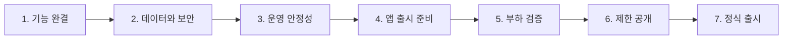

# LingKo 출시 로드맵

이 문서는 현재 구현을 앱 스토어에 공개할 수 있는 서비스로 완성하기 위한 작업 순서와 완료 기준을 정리합니다. 세부 구현은 연결된 GitHub Issue를 기준으로 진행합니다.

## 운영 원칙

- P0가 완료되지 않은 상태에서는 공개 출시하지 않습니다.
- 기능이 동작하는 것과 운영 가능한 것은 별도로 검증합니다.
- 인증, 쿼터, 평가, 저장은 하나의 유스케이스로 다룹니다.
- 외부 서비스 실패, 앱 재시도, 서버 재시작을 정상 시나리오로 간주합니다.
- 코드 계약, DB, 환경변수, 운영 방식이 바뀌면 같은 PR에서 문서를 갱신합니다.

## 전체 단계



## 1단계: 핵심 평가 흐름 완결

목표는 다음 흐름이 실패와 재시도까지 포함해 일관되게 동작하도록 만드는 것입니다.

```text
인증 사용자 확인
→ 요청 중복 확인
→ 쿼터 예약
→ 발음 평가
→ 결과 저장
→ 쿼터 확정
→ 내 기록에서 조회
```

| 순서 | 작업 | Issue | 완료 확인 |
|---:|---|---|---|
| 1 | 평가 API에 JWT 인증 사용자 연결 | [#36](https://github.com/byeok99/LingKo/issues/36) | 익명·잘못된 토큰 요청이 401 |
| 2 | 평가·쿼터·저장 통합 유스케이스 | [#37](https://github.com/byeok99/LingKo/issues/37) | 평가 후 내 기록에서 즉시 조회 |
| 3 | 쿼터 동시성 제어 | [#38](https://github.com/byeok99/LingKo/issues/38) | 남은 1회에 동시 요청 시 정확히 1회 성공 |
| 4 | 평가 요청 Idempotency | [#39](https://github.com/byeok99/LingKo/issues/39) | 재시도에도 차감·외부 호출·저장 각 1회 |

### 단계 종료 기준

- 추천 문장과 자유 문장 평가가 모두 저장됩니다.
- 사용자 A의 기록이 사용자 B에게 노출되지 않습니다.
- 외부 서비스 오류가 발생하면 정의된 정책대로 쿼터가 복구됩니다.
- 같은 요청을 여러 번 전송해도 결과가 중복 저장되지 않습니다.
- E2E 통합 테스트가 자동으로 실행됩니다.

## 2단계: 인증·개인정보·비용 보호

| 작업 | Issue | 출시 차단 사유 |
|---|---|---|
| Refresh Token 회전·폐기·로그아웃 | [#40](https://github.com/byeok99/LingKo/issues/40) | 만료 UX와 탈취 대응 부족 |
| 가이드 생성 API 접근 제어 | [#41](https://github.com/byeok99/LingKo/issues/41) | 외부 비용과 서버 자원 남용 가능 |
| 음성 보존·삭제·회원 탈퇴 | [#43](https://github.com/byeok99/LingKo/issues/43) | 개인정보·스토어 심사·저장 비용 위험 |

### 반드시 결정할 정책

1. Access Token과 Refresh Token 만료 시간
2. 사용자별 동시 로그인 기기 수
3. 원본 음성 저장 여부와 보존 기간
4. 회원 탈퇴 시 즉시 삭제할 데이터와 법적 보존 데이터
5. 평가 실패 유형별 쿼터 복구 여부
6. 가이드 생성 권한을 관리자에게만 줄지 내부 Worker에만 허용할지

## 3단계: 운영 안정성

| 작업 | Issue | 핵심 산출물 |
|---|---|---|
| 외부 서비스 복원력 | [#44](https://github.com/byeok99/LingKo/issues/44) | 타임아웃·재시도·Circuit Breaker 정책 |
| 가이드 작업 영속화와 Worker 분리 | [#42](https://github.com/byeok99/LingKo/issues/42) | 재시작에도 유실되지 않는 작업 처리 |
| 관측성 구축 | [#48](https://github.com/byeok99/LingKo/issues/48) | 로그·메트릭·알림·헬스체크 |
| CI/CD와 배포 절차 | [#49](https://github.com/byeok99/LingKo/issues/49) | 자동 검증·동일 이미지 승격·롤백 |
| 백업과 복구 훈련 | [#50](https://github.com/byeok99/LingKo/issues/50) | RPO/RTO와 실제 복구 결과 |

### 단계 종료 기준

- 인스턴스 재시작 시 사용자 세션과 작업이 유실되지 않습니다.
- 외부 서비스가 느리거나 실패해도 API 서버 전체가 고갈되지 않습니다.
- 장애 원인을 Request ID로 추적할 수 있습니다.
- DB와 S3 백업을 새 환경에 실제 복원해 봤습니다.
- 배포 실패 시 이전 버전으로 돌아가는 절차가 검증됐습니다.

## 4단계: Flutter 앱 스토어 준비

세부 작업은 [#51](https://github.com/byeok99/LingKo/issues/51)에서 관리합니다.

### 기능 체크

- 앱 시작 시 세션 복원
- Access Token 자동 갱신
- 로그인 취소와 실패 안내
- 마이크 권한 거부·영구 거부 처리
- 녹음 중 전화, 백그라운드 전환, 앱 종료 처리
- 업로드 중 네트워크 단절과 재시도
- 쿼터 소진 안내와 리셋 시각 표시
- 평가 진행·실패·재시도 상태
- 기록 추가 페이지 로딩
- 로그아웃과 회원 탈퇴

### 배포 체크

- Android application ID와 iOS Bundle ID 확정
- 앱 이름, 아이콘, 스플래시, 버전, 빌드 번호
- Android 서명 키와 iOS 인증서 보관
- 개인정보처리방침과 이용약관 URL
- 앱 내부 계정 삭제 메뉴
- 스토어 데이터 수집·외부 공유 항목 고지
- 릴리스 빌드 실기기 E2E 테스트
- Crash reporting 활성화

## 5단계: 성능 검증

| 작업 | Issue | 목표 |
|---|---|---|
| 기록 조회 N+1·Cursor 전환 | [#45](https://github.com/byeok99/LingKo/issues/45) | 기록량 증가에도 쿼리 수와 지연 안정화 |
| 음절 반복 조회 제거 | [#46](https://github.com/byeok99/LingKo/issues/46) | 평가 저장 쿼리 수 제한 |
| SLO와 부하 테스트 | [#52](https://github.com/byeok99/LingKo/issues/52) | 안전 처리량과 Scale-out 기준 확보 |
| S3 직접 업로드·비동기 평가 | [#47](https://github.com/byeok99/LingKo/issues/47) | 큰 트래픽에서 API와 Worker 독립 확장 |

비동기 평가 전환은 초기 비공개 베타의 필수 조건은 아닐 수 있지만, 공개 트래픽이 늘기 전에 설계와 전환 기준을 확정합니다.

## 6단계: 제한 공개

정식 출시 전에 소수 사용자를 대상으로 운영 환경을 검증합니다.

### 권장 순서

1. 내부 개발 계정
2. 초대 기반 10~30명
3. 100명 수준 비공개 베타
4. 지역 또는 인원 제한 공개
5. 정식 공개

### 제한 공개에서 확인할 지표

- 로그인 성공률
- 평가 성공률과 p95 처리시간
- 사용자당 평균 평가 횟수와 비용
- WAV 업로드 실패율
- Azure·Replicate 오류율
- 쿼터 충돌·중복 차감 건수
- Crash-free 사용자 비율
- 탈퇴와 데이터 삭제 처리 결과
- DB·S3 증가량

## 출시 Go/No-Go 체크리스트

다음 항목 중 하나라도 충족하지 못하면 출시를 연기합니다.

- [ ] 모든 P0 Issue 완료
- [ ] 인증·평가·저장 E2E 성공
- [ ] 중복 차감·중복 저장 0건
- [ ] 개인정보처리방침과 계정 삭제 제공
- [ ] 운영 Secret이 저장소와 이미지에 없음
- [ ] DB 백업과 복구 훈련 완료
- [ ] 핵심 알림과 대시보드 동작
- [ ] Android/iOS 릴리스 빌드 실기기 검증
- [ ] 외부 서비스 장애 시 사용자 안내와 복구 정책 확인
- [ ] 목표 부하에서 SLO 만족

## 추천 해결 순서

혼자 하나씩 진행할 때는 다음 순서를 권장합니다.

```text
#36 인증
→ #37 통합 평가 흐름
→ #38 쿼터 동시성
→ #39 Idempotency
→ #40 Refresh Token
→ #43 개인정보·탈퇴
→ #41 가이드 API 보호
→ #44 외부 서비스 복원력
→ #48 관측성
→ #49 CI/CD
→ #50 백업·복구
→ #51 스토어 준비
→ #45·#46 DB 성능
→ #52 부하 테스트
→ #42·#47 비동기 Worker 확장
```

각 Issue를 완료할 때 관련 테스트, 문서, ADR, 운영 변경을 같은 PR에 포함합니다.
